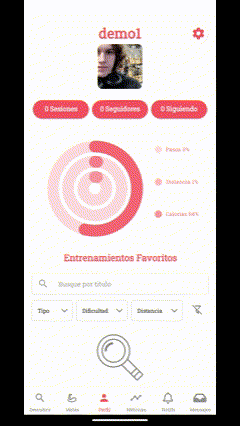
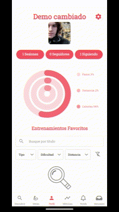
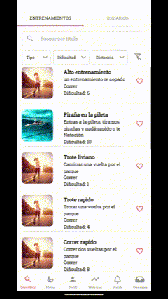
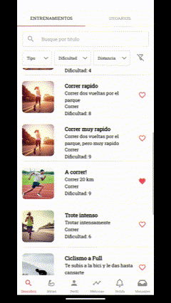
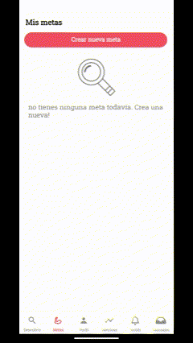
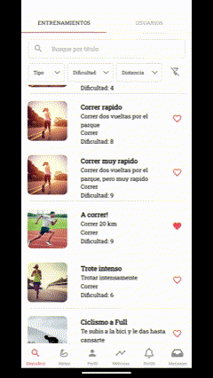
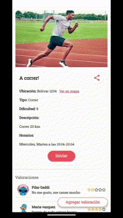
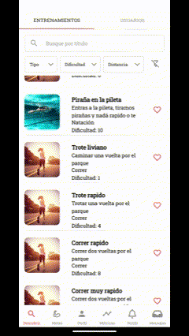
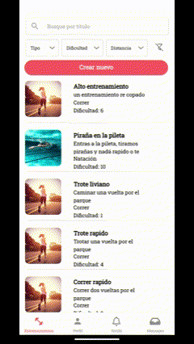

# Manual de usuario de FiuFit Mobile
### Indice:
    Atleta:
    - Registrarse
    - Login
    - Login biométrico
    - Cambiar un dato personal del perfil
    - Cambiar rol atleta/trainer
    - Buscar usuario/ver perfil
    - Buscar entrenamiento/ filtrar / ver entrenamiento
    - Establecer metas
    - Favear entrenamientos y verlos en perfil
    - Seguir atleta y verlo en seguidos
    - Compartir entrenamiento
    - Calificar entrenamiento
    - Iniciar sesión de entrenamiento
    - Mandar mensajes
    - Ver metricas y filtrar  
    Trainer:
    - Crear entrenamiento
    - Modificar entrenamiento

### Registrarse en FiuFit
Para registrarse en FiuFit, se debe ingresar a la aplicación y presionar el botón de `Registrarse` en la pantalla de inicio. Luego, puede ingresar tanto con su email creando una contraseña nueva como con una cuenta de Google.  
Luego debe ingresar su direccion y completar su información personal, esto último puede omitirlo y completarlo luego.

### Loguearse en FiuFit
Para loguearse en FiuFit, se debe ingresar a la aplicación y presionar el botón de `Iniciar sesión` en la pantalla de inicio. Luego, puede ingresar tanto con su email y contraseña como con una cuenta de Google.  

### Loguearse con biometría
Si ya inició sesión en FiuFit, puede iniciar sesión con biometría. Para ello, al iniciar la app se le ofrecerá la opción de iniciar sesión con biometría. Si acepta, se le pedirá su huella digital. Si es correcto, se iniciará sesión.

### Cambiar un dato personal del perfil
Para cambiar un dato personal del perfil, se debe ingresar a la aplicación y presionar el botón de `Perfil` en la pantalla de inicio. Luego, se debe presionar el botón de `Ajustes`⚙️  en la parte superior derecha de la pantalla.  
Luego podrá elegir que dato desea cambiar y modificarlo.

### Cambiar rol a Atleta o Entrenador
Para cambiar el rol de Atleta a Entrenador o viceversa, se debe ingresar a la aplicación y presionar el botón de `Perfil` en la pantalla de inicio. Luego, se debe presionar el botón de `Ajustes`⚙️ en la parte superior derecha de la pantalla.  
Junto a los datos personales se encuentra el rol para que pueda cambiarlo al que desee, luego de cambiar de rol tendrá diferentes opciones en la aplicación.

### Buscar usuario y ver su perfil
Para buscar un usuario y ver su perfil, se debe ingresar a la aplicación y presionar el botón de `Descubrir`🔍 en la pantalla de inicio. Luego, se debe presionar la pestaña de `Usuarios` en la parte superior de la pantalla.  
Allí podrá buscar un usuario por su nombre y ver su perfil.

### Buscar entrenamiento y ver su contenido
Para buscar un entrenamiento y ver su contenido, se debe ingresar a la aplicación y presionar el botón de `Descubrir`🔍 en la pantalla de inicio. Luego, se debe presionar la pestaña de `Entrenamientos` en la parte superior de la pantalla.  
Una vez allí primero se le mostrarán entrenamientos recomendados basados en sus gustos, luego podrá buscar un entrenamiento por su nombre, categoría o dificultad y ver su contenido.
También puede filtrar los entrenamientos por categoría, dificultad o cercanía.

### Establecer metas
Para establecer metas, se debe ingresar a la aplicación y presionar el botón de `Metas` en la pantalla de inicio. Luego, se debe presionar el botón de `Agregar Meta` y completar los datos de la meta deseada, también puede incluir una imagen a su nueva meta.  
Cuando complete una meta se le notificará mediante una notificación móvil.

### Marcar entrenamientos como favoritos y verlos en su perfil
Para agregar un entrenamiento a su lista de entrenamientos favoritos se debe ingresar a la aplicación y presionar el botón de `Descubrir`🔍 en la pantalla de inicio. Luego, se debe presionar la pestaña de `Entrenamientos` en la parte superior de la pantalla.  
Una vez allí podrá presionar en el boton de `Favorito`❤️ en el entrenamiento que desee.  
Para ver sus entrenamientos favoritos se debe presionar el botón de `Perfil` en la pantalla de inicio, allí verá sus entrenamientos favoritos listados.

### Seguir atleta y verlo en usuarios seguidos
Para seguir a un atleta se debe ingresar a la aplicación y presionar el botón de `Descubrir`🔍 en la pantalla de inicio. Luego, se debe presionar la pestaña de `Usuarios` en la parte superior de la pantalla.  
Allí elegir el atleta que desea seguir ([Buscar Usuario](#buscar-usuario-y-ver-su-perfil)) y presionar el botón de `Seguir` en su perfil.  
Luego encontrará a los usuarios seguidos en la pestaña de `Seguidos` en la pantalla de `Perfil`.

### Compartir entrenamiento
Para compartir un entrenamiento se debe ingresar a la aplicación y presionar el botón de `Descubrir`🔍 en la pantalla de inicio. Luego, se debe presionar la pestaña de `Entrenamientos` en la parte superior de la pantalla.  
Una vez allí podrá presionar en el boton de `Compartir`📤 en el entrenamiento que desee mediante la app que desee.  

### Valorar entrenamiento
Para Valorar un entrenamiento se debe acceder a un entrenamiento ([Buscar Entrenamiento](#buscar-entrenamiento-y-ver-su-contenido)) y presionar en el boton de `Agregar valoración`⭐, luego elegir la cantidad de estrellas junto con el comentario que desee.

### Iniciar sesión de entrenamiento
Para iniciar sesión de un entrenamiento se debe acceder a un entrenamiento ([Buscar Entrenamiento](#buscar-entrenamiento-y-ver-su-contenido)) y presionar el botón de `Iniciar Entrenamiento` en la parte inferior de la pantalla.  
Luego comenzará la sesión de entrenamiento y podrá ver su progreso en la pantalla.  
Cuando finalice la sesión de entrenamiento presione el botón de `Finalizar Entrenamiento` en la parte inferior de la pantalla, allí se le mostrará un resumen de su sesión de entrenamiento y podrá elegir si desea compartirlo.

### Mandar mensajes
Para mandar mensajes se debe ingresar a la aplicación y presionar el botón de `Mensajes`📥 en la pantalla de inicio. Luego, se debe presionar el botón de `Nuevo Mensaje` y elegir el usuario al que desea mandarle un mensaje.

### Ver métricas de entrenamiento y filtrar por fecha
Para ver las métricas de un entrenamiento se debe ingresar a la aplicación y presionar el botón de `Perfil` en la pantalla de inicio. Luego, se debe presionar el botón de `Métricas` y podrá filtrar por período de tiempo (dia, mes y año) o por métrica (pasos, calorías y distancia).  
También puede moverse en el grafico usando las flechas.

### Crear entrenamiento
Estando en rol `Entrenador` ([Cambiar rol Alteta/Entrenador](#cambiar-rol-a-atleta-o-entrenador)) y dentro de la pestaña de `Entrenamientos` debe presionar en `Nuevo Entrenamiento` y completar la información del entrenamiento.  
También puede agregar una imagen al entrenamiento si lo desea.

### Modificar entrenamiento
Estando en rol `Entrenador` ([Cambiar rol Alteta/Entrenador](#cambiar-rol-a-atleta-o-entrenador)) y dentro de un entrenamiento debe presionar en `Modificar` y luego cambiar el campo que desee, al finalizar presione `Guardar`.

